241:
- MIPS32
- instruction: 32 bits, instruction size has no direct relationship with 32/64 bits system
- PC increment: 4 bytes
- word: 4 bytes
- register size: 32 bits
- memory address: 32 bits, each memory address refer to a byte block, hence byte addressing
- memory capacity: 2^32 bytes
- every data in RAM is one word, 4 bytes, 32 bits


# Lecture 1
nibble: 4 bits \
byte: 8 bits \
32-bit (4 bytes), 64-bit (8 bytes) machine means the size of ***"word"***

To compactly represent binary in less space, use hexadecimal. Each hexadecimal character is a nibble (4 bits). \
10011101 = 0x9d

What do bytes represent?
- numbers
- characters
- Instructions! (Parts of instructions in our case. Words, or 4 bytes, will correspond to a complete instruction for our computer system).

241 is only considering 32 bit machine, so word is only 4 bytes, 32 bits

## Bytes as Binary Number
- Unsigned (non-negative integers)
- Signed integers
- floating point, algebraic, etc

### Unsigned Integers
10011101 = 2^7 + 2^4 + 2^3 + 2^2 + 2^0
```
    0100 1001
  + 0111 1111
---------------
    1100 1000
```
If overflow error happen, the extra bit is ***GONE***, it doesn't polute other memory space (at least for MIPS)

Convert to binary
```
Number Quotient Remainder
  38     19         0
  19     9          1
  9      4          1
  4      2          0
  2      1          0
  1      0          1
```
so 38<sub>10</sub> = 00100110<sub>2</sub>, just fill in the leading 0s to make it 1 byte, 8 bits long

### Signed Integers
Two's complement
- sign-magnitude: first bit is 0 if non-negative, 1 if negative
- negate a value by just subtracting from zero and ***letting it overflow***
```
      (borrow 1)  0000 0000      = 0
  -               0000 0001      = 1
------------------------------
                  1111 1111      = -1
```
Remeber that overflow is GONE!!

- A trick to get negate two's complement numbers
    1. Take the complement of all bits
    2. Add 1
- A slightly faster trick is to locate the rightmost 1 bit and flip all the bits to the left of it.

11011010 becomes 00100110 after negation, and vice versa

Note: Flipping the bits and adding 1 is the same as subtracting 1 and flipping the bits for non-zero numbers (exercise), or subtracting from 0.

Exercise: convert between twos complement and decimal, both ways

Arithmetic of signed int works just like unsigned int. Note that any final carry overs are ignored!!
```
                 0000 0100 (+4)
  +              1111 1101 (−3)
--------------------------------------
    (ignored 1)  0000 0001 (1)


    (ignored 1)  1111 1100 (−4)
  +              1111 1101 (−3)
--------------------------------------
                 1111 1001 (-7)

Carry over are ignored in both cases
```

### Natural Definition
- Most Significant Bit (MSB) is the left-most bit (highest value/sign bit)
- Least Significant Bit (LSB) is the right-most bit (lowest value)

## Bytes as Characters
size of an ASCII character is 1 byte, 8 bits

ex: in ASCII, 'a' is represented as 97<sub>10</sub> = 61<sub>16</sub> = 01100001<sub>2</sub>

# Lecture 2
## Bit-Wise Operators
- `~` bitwise not
- `&` bitwise and
- `|` bitwise or
- `^` bitwise exclusive or
- `x >> n` bitwise shift right, equivalent to `x /= 2^n`, overflow is thrown away, careful bitshift ambiguity with signed values
- `<< n` bitwise shift left, equivalent to `x *= 2^n`
- `C &= 5` combine bitwise operation with assignment, equivalent to `c = c & 5`

There are many ways to interpret the bits in memory, they can be signed int, unsigned int, char, etc. No interpretation is "more correct" than others. So we need to remember how the bits were intended to be interpreted when we store it in memory.

## Instructions
Many different processor-specific machine languages exist

We use MIPS32 in 251

## Registers
MIPS has 32 general purpose registers ($0 ~ $31) and two more registers hi and lo (for multiplication and division). But only $1 ~ $28 can be used for storage
- `$0` is always 0
- `$31` is for return addresses
- `$30` is our stack pointer
- `$29` is our frame pointer

Persnickety comment: In most MIPS standards, the roles of $29 and $30 above are reversed. It’s just a convention.


## How MIPS Works
Convention is to set memory address 0 in RAM to be an instruction. MIPS will also have a special register called the Program Counter (or PC for short) to tell us what instruction to do next. A program called a loader puts our program into memory and sets the PC to be the first address. We’ll talk about loaders (much) later.

OS uses a special program called ***loader*** to load our program from hard drive into memory. Loader also set PC to be the starting memory address of the program that it just loaded (ie: PC = 0). After our own program is finished, we will use `jr $31` to set PC back to address of the loader program.

### Fetch-Execute Cycle
A hardware-based algorithm known as the Fetch-Execute Cycle is always running on every clock cycle.
``` c
PC = 0
while true do
  IR = MEM[PC]    // fetch, IR is instruction register
  PC += 4
  Decode and execute instruction in IR  "do it"   // decode
                                                  // execute
end while
```

Abstraction!!! Eventually an instruction will break out of the loop. This is basically the only program a machine really runs.

crash condition:
- lw/sw to addr not multiple of 4 (in 32 bit system, all data are stored as a word, which is 4 byte)
- invalid MIPS instriuction

## Addition
Write a program in MIPS that adds the values of registers $8 and $9 and stores the result in register $3.

``` arm
add $d, $s, $t
0000 00ss ssst tttt dddd d000 0010 0000
```
Adds registers `$s` and `$t` and stores the sum in register `$d`. Important! The order of `$d`, `$s` and `$t` are shifted in the encoding!

Solution:
``` arm
add $3, $8, $9
0000 0001 0000 1001 0001 1000 0010 0000
```

# Lecture 3
## Putting Values in Registers
MIPS doesnt support arithmatic operation with immediates, store in register first, then do add/sub/mult/div

`lis $d: 0000 0000 0000 0000 dddd d000 0001 0100` \
Load immediate and skip. This places the next value (.word) in RAM [an immediate] into $d and increments the program counter by 4 (it skips the next line which is usually not an instruction, aka .word).

`.word i: iiii iiii iiii iiii iiii iiii iiii iiii` \
This is an assembler directive ***(not a MIPS instruction)***. The value i, as a two’s complement integer, is placed in the correct memory location in RAM as it occurs in the code. Can also use hexadecimal values: `.word i`


Write a MIPS program that adds together 11 and 13 and stores the result in register $3.

Incomplete example
``` arm
lis $8
.word 11
lis $9
.word 0xd
add $3,$8,$9
```
This is what we call ***assembly code***, when each line is translated into 1s and 0s, it becomes machine code

## Jump Register (non-conditional branch)
We need to return control back to loader

`jr $s`: Jump register, set PC to be $s.

For us, return addr will typically be $31. `jr $31` will return control to the loader

Complete example
``` arm
lis $8
.word 11
lis $9
.word 0xd
add $3,$8,$9
jr $31
```

## More Operations
- `mult $s, $t`: Performs the multiplication and places the most significant word (largest 4 bytes, 32 bits, exact size of register) in `hi` and the least significant word in `lo`.
- `div $s, $t`: Performs integer division and places the quotient *$s / $t* in `lo` and the remainder *$s % $t* in `hi`. Note the sign of the remainder matches the sign of the divisor stored in $s.
- `mfhi $d`: Move from register hi into register $d
- `mflo $d`: Move from register lo into register $d

## RAM
Cannot directly use the data in the RAM. Must transfer first to registers. **Address must be round up to multiple of 4!!!**

### Operations on RAM
- `lw $t, i($s)`: load the word in **MEM[$s + i]** and store in $t
- `sw $t, i($s)`: load the word in $t and store it in **MEM[$s + i]**

i is a signed integer (immediate), could be negative (ie: -1), NOT another register!!

Example: Suppose that $1 contains the address of an array and $2 takes the number of elements in this array (assume less than 220). Place the number 7 in the last possible spot **in the array**, at [$2 - 1].
``` arm
lis $8
.word 0x7
lis $9
.word 4
mult $2, $9
mflo $3
add $3, $3, $1
sw $8, -4($3)
jr $31   // always include "jr 31" at the end of every program
```

## Branching
Remember in the fetch-execute cycle, `PC += 4` happen **before** instruction is decoded and executed

- `beq $s, $t, i`: Branch on equal. If $s == $t then pc += i * 4. That is, ***skip*** ahead i many instructions if $s and $t are equal (unlike 251, which set PC to next i-th line). Does nothing if condition failed, PC will go to next instruction naturally by fetch-execute cycle.
- `bne $s, $t, i`: Branch on not equal.


Example: Places the value 3 in register $2 if the signed number in register $1 is odd and places the value 11 in register $2 if the number is even.
``` arm
lis $8
.word 2
lis $9
.word 3
lis $2
.word 11
div $1, $8
mfhi $3
beq $3, $0, 1
add $2, $9, $0
jr $31
```

## Inequality Command
`slt $d, $s, $t`: Set less than. $d = 1 if $s < $t else $d = 0

Example: Negates the value in register $1 provided it is positive.
``` arm
slt $2, $1, $0
bne $2, $0, 1
sub $1, $0, $1
jr $31
```

## Looping
Adds together all even numbers from 1 to 20 inclusive. Store the answer in register $3.
``` arm
lis $2
.word 20
lis $1
.word 2
add $3, $0, $0
add $3, $3, $2 ; line -3
sub $2, $2, $1 ; line -2
bne $2, $0, -3 ; line -1, branch from here
jr $31         ; line 0
```
Note: semicolons for comments in MIPS assembly

If branch backward with -1, it'll be infinite loop!!

## Labels
`label:`

Since counting lines to skip with branching is TEDIOUS, we introduce lables so assemblers can figure out the number of lines to skip for us

Labels are not commands, thus don't take line number for themselves. Instead, it has the address of what would be the first instruction after the label.

### Explicit Example
``` arm
sub $3, $0, $0
sample:
    add $1, $0, $0
```
sample has the address 0x4, which is the location of `add $1, $0, $0`

### Looping Revisited
```arm 
lis $2
.word 20
lis $1
.word 2
add $3, $0, $0
top:
    add $3, $3, $2
    sub $2, $2, $1
    bne $2, $0, top
jr $31
```

Exercise: Places the absolute value of register $1 in register $2.

``` arm
slt $3, $1, $0
add $2, $1, $0
beq $3, $0, pos
sub $2, $0, $2
pos:
    jr $31
```


# Lecture 4
## Procedures / Function
In order to preserve registers when calling procedures/functions, we store all registers in RAM before entering procedures, and restore them before ending procedures. However, we can't use the same RAM, cuz that'll overwrite again if a function is called inside another function.

### Use Stack
```
|-----------------|
|  Your Program   |
|-----------------|
|                 |
|                 |
|    Free RAM     |
|  low memory adr |
|                 |
|                 |  < $30
|-----------------|  $30
|                 |  > $30
|    Used RAM     |
| high memory adr |
|                 |
|-----------------|

free RAM: < $30
used RAM: >= $30

$30 holds the address of the first 4 bytes memory block that is used in stack
```

- Calling procedures pushes more registers onto the stack and returning pops them off.
- This is a stack, and we call `$30` our ***stack pointer***.
- We can also use the stack for local storage if needed in procedures. Just reset `$30` before procedures return.

### Template for Procedures
Template for a procedure *f* that modifies registers $1 and $2:
``` mips
f:
    sw $1, -4($30) ; Push registers we modify
    sw $2, -8($30)
    lis $2 ; Decrement stack pointer
    .word 8
    sub $30, $30, $2

    ; Insert procedure here

    add $30, $30, $2 ; Assuming $2 is still 8
    lw $2, -8($30) ; Pop = restore
    lw $1, -4($30)
    ; Uh oh! How do we return to the previous procedure from where f was called
```

We could also store all registers everytime to stack, but that involves more read/write to RAM than needed, and slow down the system. Generally, write actual code fist, then store/load registers.

Another problem with storing & restoring all registers in every procedure is that we will lose the ability to return

### Returning
``` mips
main:
  lis $8
  .word f ; Recall f is a label, thus f is just an address
  jr $8 ; non-conditional branching, jump to the first line of f
  (NEXT LINE)
```

Once f completes, we really want to jump back to the line labelled above as (NEXT LINE), i.e., set the program counter back to that line. How do we do that?

### jalr
`jalr $s`, jump and link register. Sets $31 to be the current PC, and then sets the PC to be $s.

We need to save and restore $31 when using jalr!!! Since jalr will overwrite $31, and we still want to return to loader, or the previous procedure after using jalr

``` mips
main:
    sw $31, -4($30) ; Push $31 to stack
    lis $31 ; Use $31 since it’s been saved
    .word 4
    sub $30, $30, $31
    lis $8
    .word f
    jalr $8 ; Overwrites $31
    lis $31 ; Use $31 since we’ll restore it
    .word 4
    add $30, $30, $31
    lw $31, -4($30) ; Pop $31 from stack
    jr $31 ; Return to loader


f:
    sw $1, -4($30) ; Push registers we will modify
    sw $2, -8($30)
    lis $2
    .word 8
    sub $30, $30, $2 ; Decrement stack pointer
    
    ; Insert procedure here

    add $30, $30, $2 ; Assuming $2 is still 8
    lw $2, -8($30) ; Pop registers to restore
    lw  $1, -4($30)
    jr $31 ; New line!!!!!!!!!!    Return to main
```

### Pass Parameters
Typically, we’ll just use registers. If we have too many, we could push parameters to the stack and then pop them from the stack. Documentation is vitally important here!

If we can do this correctly, then everything, including recursion, should just work properly.

Sum Evens 1 to N
``` mips
; sumEvens1ToN adds all even numbers from 1 to N
; Registers:
; $1 Scratch Register (Should Save!)
; $2 Input Register (Should Save!)
; $3 Output Register (Do NOT Save!)
sumEvens1ToN:
    sw $1, -4($30) ; Save $1 and $2
    sw $2, -8($30)
    lis $1
    .word 8
    sub $30, $30, $1 ; Decrement stack pointer
    add $3, $0, $0 ; Don’t forget to initialize $3!
    lis $1
    .word 2
    div $2, $1 ; Is N even?
    mfhi $1
    sub $2, $2, $1 ; Sub 1 if not
    lis $1
    .word 2 ; Restore 2
    top:
        add $3, $3, $2
        sub $2, $2, $1
        bne $2, $0, top
    lis $1
    .word 8
    add $30, $30, $1
    lw $2, -8($30)
    lw $1, -4($30) ; Reload $1 and $2
    jr $31 ; Back to caller
; End sumEvens1ToN
```

## I/O
We print to screen or read input one byte at a time
- Output: Use `sw` to store words (each word is 4 byte) to location 0xffff000c. Least significant byte (rightmost byte) will be printed
- Input: Use `lw` to load words from location 0xffff0004. Least significant byte will be the next character from stdin.
    - If there are no bytes left to read (the “end of file” is reached) then the destination register will contain 0xffffffff (the two's complement encoding of -1).

Example: Print CS241 to the screen followed by a newline character
``` arm
lis $1
.word 0xffff000c
lis $2
.word 67 ; C
sw $2, 0($1)
lis $2
.word 83 ; S
sw $2, 0($1)
lis $2
.word 50 ; 2
sw $2, 0($1)
lis $2
.word 52 ; 4
sw $2, 0($1)
lis $2
.word 49 ; 1
sw $2, 0($1)
lis $2
.word 10 ; \n
sw $2, 0($1)
jr $31
```

# Lecture 5
## The Assembler
Recall: part of our long-term goal is to convert assembly code (our MIPS language) into machine code (bits).
- Input: Assembly code
- Output: Machine code

Any such translation process involves two phases: Analysis and Synthesis.
- Analysis: Understand what is meant by the input source
- Synthesis: Output the equivalent target code in the new format

### Summary of Passes
Pass 1:
- Group tokens into instructions
- Build Symbol Table one label at a time
- At the end of code, table is complete.

Pass 2:
- Translate each instructions to machine code
- For each label in an instruction, look up in symbol table and process accordingly

### Creating Binary In C++
Ex: `bne $2, $0, -3` correspond to `00010100 01000000 11111111 11111101`

Break it down into 
- bne has opcode: `000101` = 5
- Register s is: `00010` = 2
- Register t is: `00000` = 0
- Offset is: `1111111111111101` = -3

``` c++
// Use bit shift, bitwise or, bit mask 
int instr = (5 << 26) | (2 << 21) | (0 << 16) | (-3 & 0xffff);  // corespond to 339804157 in decimal
// can't just cout << instr, this will print 9 bytes (char is 1 byte) each correspond to ASCII value of a digit in 339804157
// instead, use unsigned char, which will be printed directly with no extra convertion
// explicitly state unsigned, since char by default could be signed or unsigned, depending on system
unsigned char c = instr >> 24;
cout << c;
c = instr >> 16;
cout << c;
c = instr >> 8;
cout << c;
c = instr;
cout << c;
```

Note: Can also mask here to get the ’last byte’ by doing `& 0xff` if worried about which byte will get copied over. But when converting to char, it should only take the right most byte.

# Lecture 6
## Formal Languages
same definition as 239
- An **alphabet** is a non-empty, ***finite*** set of symbols, often denoted by Σ (capital sigma).
- A **string** (or **word**) w is a finite sequence of symbols chosen from Σ . The set of all strings over an alphabet Σ is denoted by Σ<sup>∗</sup>.
- A **language** is a set of strings.
- The **length of a string** w is denoted by |w|.

### Examples
Alphabets:
- Σ={a,b,c,...,z}, the Latin (English) alphabet.
- Σ = {0, 1}, the alphabet of binary digits.
- Σ = {0, 1, 2, ..., 9}, the alphabet of base 10 digits.

Strings:
- ε (epsilon) is the empty string. It is in Σ<sup>∗</sup> for any Σ. |ε| = 0
- For Σ = {0, 1}, strings include w = 011101 or x = 1111. Note |w| = 6 and |x| = 4.

Note: For our course, assume Σ will never contain the symbol ε. ε is just a notational convention; the actual string is empty.

Languages:
- L = ∅ or {}, the empty language
- L = {ε}, the language consisting of (only) the empty string
- L = {ab<sup>n</sup>a : n ∈ N}, the set of strings over the alphabet Σ = {a, b} consisting of an a followed by 0 or more b characters followed by an a

Note: ∅ or {} != {ε}

### Objective:
Given a language, determine if a string belongs to it.

In order of relative difficulty to determine membership in laguages:
- finite
- regular
- context-free
- context-sensitive
- recursive
- impossible languages

## Finite Languages
Q: Why are these easy to determine membership? \
A: To determine membership in a language, just check for equality with all words in the language!

we could just run an exhaustive search of ever strings in the language, but we want to find a more efficient apporach

Ex: Suppose we have the language L = {bat, bag, bit}. Write a program that determines whether w ∈ L given that each character of w is scanned exactly once without the ability to store previously seen characters.
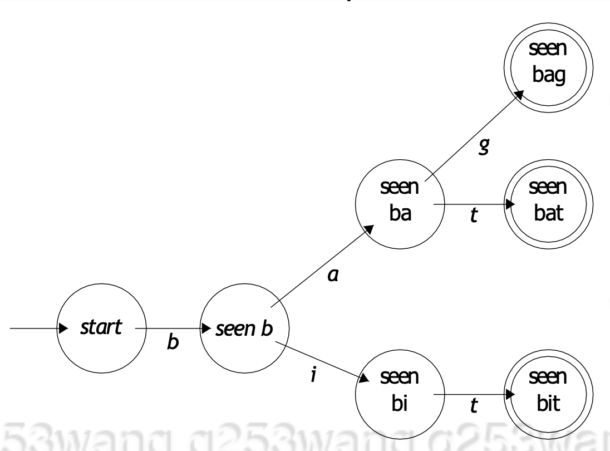

Ex 2:
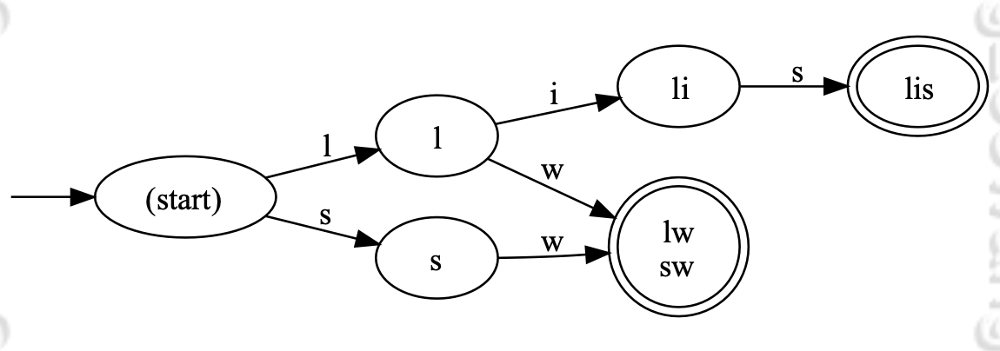

- An arrow into the initial start state.
- Accepting states are two circles.
- Arrows from state to state are labelled.
- Error state(s) are implicit (a common “hack”).

## Regular Languages
Beyond the finite \
Despite the simplicity of the finite examples, these diagrams can easily generalize to recognize a larger class of languages known as *regular languages*.

Regular languages are defined recursively as follows, a regular language over an alphabet Σ is one of the following
1. The empty language and the language consisting of the empty word are regular
2. All languages {a} for all a ∈ Σ are regular.
3. The union, concatenation or Kleene star of any two regular languages are regular. **Hence, regular languages could be infinite**
4. Nothing else.

### Union, Concatenation, Kleene Star
Let L, L<sub>1</sub> and L<sub>2</sub> be three regular languages. Then the following are regular languages

- Union: L<sub>1</sub> ∪ L<sub>2</sub> = {x : x ∈ L<sub>1</sub> or x ∈ L<sub>2</sub>}
- Concatenation: L<sub>1</sub> · L<sub>2</sub> = L<sub>1</sub> L<sub>2</sub> = {xy : x ∈ L<sub>1</sub>, y ∈ L<sub>2</sub>}
- Kleene star: L<sup>* </sup> = {ε} ∪ {xy : x ∈ L<sup>*</sup>, y ∈ L} = Union(n: 0  -> infinity) L<sup>n</sup>

#### Example
Suppose that L<sub>1</sub> = {up, down}, L<sub>2</sub> = {hill, load} and L = {a, b} over appropriate alphabets. Then
- L<sub>1</sub> ∪ L<sub>2</sub> = {up, down, hill , load}
- L<sub>1</sub> L<sub>2</sub> = {uphill, upload, downhill, download}
- L<sup>∗</sup> = {ε, a, b, aa, ab, ba, bb, aaa, aab, aba, abb, baa, bab, ...}

Q: Let Σ = {a, b}. Explain why the language L = {ab<sup>n</sup>a : n ∈ N} is regular.

Solution: {a} and {b} are finite, and so regular. {b}<sup>∗</sup> is also regular, regular languages are closed under Kleene star. Then, the concatenation {a} · {b}<sup>∗</sup> · {a} must also be regular.

### Regular Expressions
Regular expressions are just a way of expressing regular languages.

The notation is very similar, except we drop the set notation.
- {ε} becomes ε (and similarly for other singletons).
- L<sub>1</sub> ∪ L<sub>2</sub> becomes L<sub>1</sub> | L<sub>2</sub>
- Concatenation is never written with the explicit ·
- Order of operations: ∗, · then |. (Kleene star, concatenation, then union). The previous example as a regular expression would be ab∗a.

ab∗a could also be represented using diagrams/pictures
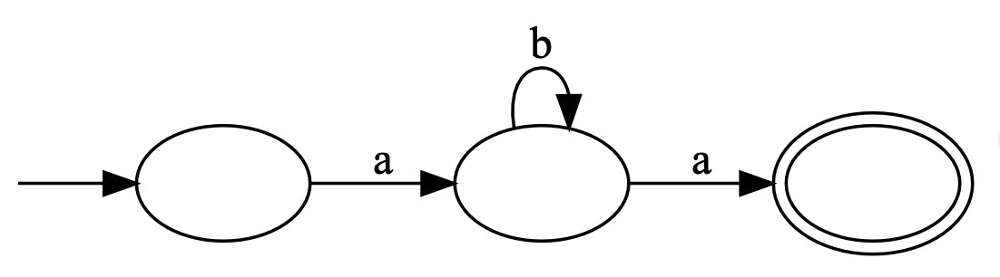

In 241, we don't need to draw error state (single circle with no arrows going out)

### Deterministic Finite Automata (DFA)
The drawing, which looks like a turing machine, is essentially a machine called DFA.

A DFA is a 5-tuple (Σ, Q, q<sub>0</sub>, A, δ):
- Σ is a finite non-empty set (alphabet).
- Q is a finite non-empty set of states.
- q<sub>0</sub> ∈ Q is a start state, there should be one and only one starting state
- A ⊆ Q is a set of accepting states (double circle, could have more than one accepting state since it's a set)
- δ: (Q × Σ) → Q is our [total] transition function (given a state and a symbol of our alphabet, what state should we go to?).

Should only check if the final state is accepting once the input is exhausted. If so, accept. Otherwise reject. This is because we could move through accepting state, but NOT actually land on accepting state

#### Example
If we were to construct a DFA for MIPS lables

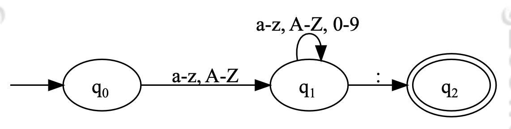

- Σ = {ASCII characters}
- Q = {q<sub>0</sub>, q<sub>1</sub>, q<sub>2</sub>}
- q<sub>0</sub> is our start state
- A = {q<sub>2</sub>} ***(note: this is a set!)***
- δ is defined by
    - δ(q<sub>0</sub>, letter) = q<sub>1</sub>
    - δ(q<sub>1</sub>, letter or number) = q<sub>1</sub>
    - δ(q<sub>1</sub>, :) = q<sub>2</sub>, ":" here is just a symbol in the alphabet
    - All other transitions go to an error state.

# Lecture 7
## DFA δ<sup>∗</sup>
δ<sup>∗</sup> : (Q × Σ<sup>∗</sup>) → Q
- δ<sup>∗</sup>(q, ε) → q, (*base case*)
- δ<sup>∗</sup>(q, aw) → δ<sup>∗</sup>(δ(q, a), w)

where q ∈ Q, a ∈ Σ and w ∈ Σ<sup>∗</sup>

This is the formal definition, but it just means that when processing a string with DFA, it first process the first letter, then process the rest of the string, recursively until base case

## Language of DFA
A DFA given by *M = (Σ, Q, q<sub>0</sub>, A, δ)* **accepts a string** *w* if and only if *δ<sup>∗</sup>(q<sub>0</sub>, w) ∈ A*.

The **language of a DFA** *M* is the set of **all** strings accepted by *M*, that is: *L(M) = {w : M accepts w}*

### Kleene Theorem
L is regular ***if and only if*** L = L(M) for some DFA M. That is, the regular languages are precisely the languages accepted by DFAs.

We also know that regular languages can all be presented in terms of regular expressions, so we can also say that everything that can be represented using regex can be handled by some DFA, and vice versa.

### DFA Implementation
DFA recognition algorithm
``` bash
w = a1a2...an
s = q0

for i in 1 to n do
    s = δ(s, ai)
end for

if s in A then
    Accept
else
    Reject
end if
```

As for δ, it could be implemented as a look up table, with Q and Σ as the two axis. Each entry will indicate the next state

### Extension to DFA
We could also do some actions (ie: calculation) while going through DFA, just need to make sure the transition state is on the left side of "/", and the actions are on the right side of "/"

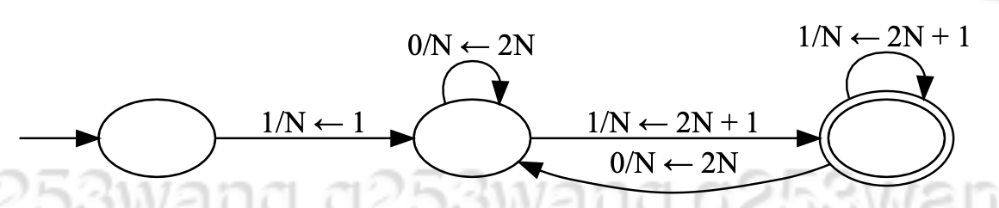

### Multiple Transitions
What if we allow more than one transition from a state with the same symbol? We would explore all possibilities just like BFS, and see if we reach any accepting state in the end. Since we don't know exactly which path to take at such states, this process is called ***non-determinism***

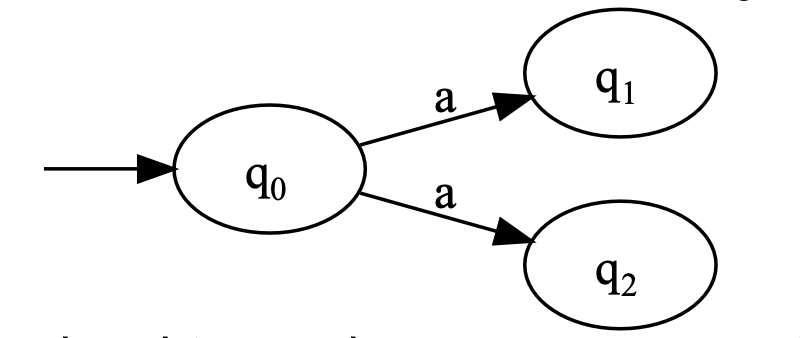

#### Example
L = {w : w ends with bba}

Machine "guesses" to stay in q<sub>0</sub> until "bba" is seen by exploring all options at every state

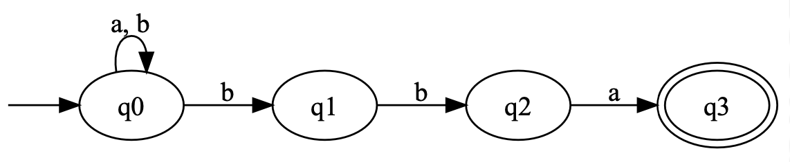

## Language of NFA (Non-Deterministic Finite Automata)
Let *M* be an NFA. We say that *M* **accepts** *w* if and only if there exists some path through *M* that leads to an accepting state.

### Formal Definition
An NFA is a 5-tuple (Σ, Q, q<sub>0</sub>, A, δ):
- Σ is a finite non-empty set (alphabet).
- Q is a finite non-empty set of states.
- q<sub>0</sub> ∈ Q is a start state
- A ⊆ Q is a set of accepting states
- δ : (Q × Σ) → 2<sup>Q</sup> is our [total] transition function
    - Note that 2<sup>Q</sup> denotes the *power set* of Q, that is, the set of all subsets of Q (covered in 239). This allows us to go to multiple states at once!

The definition is exactly the same as DFA, except for δ !!!

### NFA δ<sup>*</sup>
We extend the definition of δ:(Q × Σ) → 2<sup>Q</sup> to a function δ<sup>∗</sup>: (2<sup>Q</sup> × Σ<sup>∗</sup>) → 2<sup>Q</sup> via:

- δ<sup>∗</sup>(S, ε) -> S
- δ<sup>∗</sup>(S, aw) -> δ<sup>∗</sup>( Union(q: S) δ(q, a) , w )
    - note that δ(q, a) gives a subset of Q, and union of multiple subsets of Q is still a subset of Q
<!-- 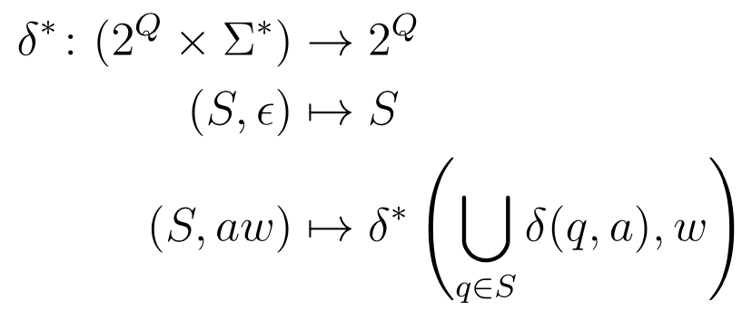 -->
where S ⊆ Q, a ∈ Σ and w ∈ Σ<sup>∗</sup>

The biggest difference compare to DFA δ<sup>* </sup> is that the first argument in δ<sup>*</sup> is now a subset of Q, instead of an element in Q

Now we can give a formal definition for what it means to accept a string in NFA. \
An NFA given by *M = (Σ, Q, q<sub>0</sub>, A, δ)* **accepts a string** *w* if and only if *δ<sup>∗</sup>({q<sub>0</sub>}, w) ∩ A != ∅*

The language of an NFA *M* is the set of **all** strings accepted by *M*, that is: *L(M) = {w : M accepts w}*

### NFA Implementation
NFA recognition algorithm
``` bash
w = a1a2...an
s = {q0}

for i in 1 to n do
    s = Union(q: S) δ(q, ai)
end for

if s ∩ A != ∅ then
    Accept
else
    Reject
end if
```

### Example
Language of strings end in *bba*, with input *w = abbba*

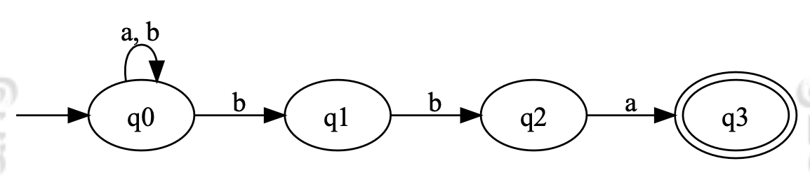

```
    Processed   |    Remaining    |       S
-----------------------------------------------------
        ε       |      abbba      |   {q0}
        a       |      bbba       |   {q0}
        ab      |      bba        |   {q0, q1}
        abb     |      ba         |   {q0, q1, q2}
        abbb    |      a          |   {q0, q1, q2}
        abbba   |      ε          |   {q0, q3}
```

Since *{q<sub>0</sub>, q<sub>3</sub>} ∩ q<sub>3</sub> != ∅*, accept *w = abbba*

## NFA to DFA
- NFAs are not more powerful than DFAs!
- Why not: Even the power-set of a set of states is still finite. So, we can represent sets of states in the NFA as single states in the DFA!

The previous NFA becomes the DFA. This convertion algorithm is not testable material!!!

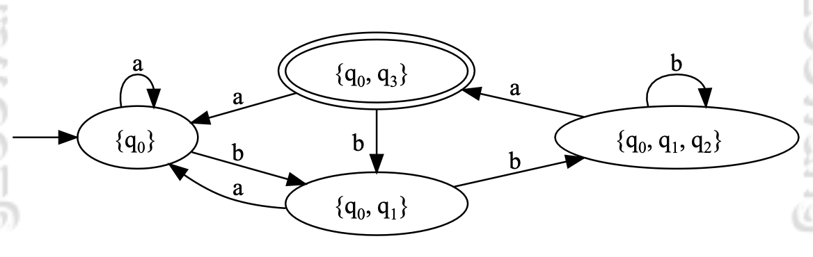

# Lecture 8
### Summary
- From Kleene’s theorem, the set of languages accepted by a DFA are the regular languages
- The set of languages accepted by DFAs are the same as those accepted by NFAs
- Therefore, the set of languages accepted by an NFA are precisely the regular languages!

Comparing to DFA, we gained no new computer power from an NFA. \
What if we permitted state changes without reading a character (hence reading ε, called ε-transition)?

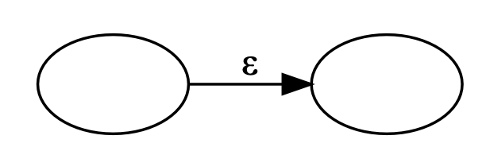

## ε-Non-Deterministic Finite Automata (ε-NFA)
An ε-NFA is a 5-tuple (Σ, Q, q0, A, δ):
- Σ is a finite non-empty set (alphabet) **that does not
contain the symbol ε**.
- Q is a finite non-empty set of states.
- q<sub>0</sub> ∈ Q is a start state
- A ⊆ Q is a set of accepting states
- δ : (Q × (Σ ∪ {ε})) → 2<sup>Q</sup> is our [total] transition function. Note that 2<sup>Q</sup> denotes the power set of Q, that is, the set of all subsets of Q. This allows us to go to multiple states at once!

Now we can use ε-transition to make it trivial to take the union of two NFAs

Ex: L = {abc} ∪ {w : w ends with cc}
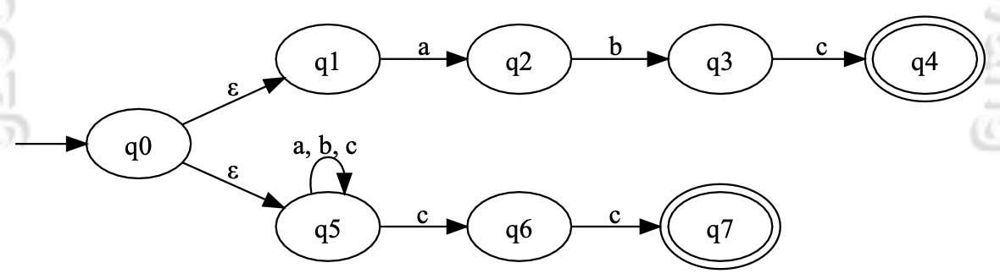

### ε-NFA δ<sup>∗</sup>
Epsilon closure of a **set of states S**, E(S), is the set of all states rechable from S in **0 or more** ε-transitions. Note, this implies that S is a subset of E(S), S ⊆ E (S). And, E(S) can get to everything that require no move, not just its neighbors

We can now extend the definition of δ: (Q × (Σ ∪ {ε})) → 2<sup>Q</sup> to δ<sup>*</sup>: (2<sup>Q</sup> × Σ<sup>∗</sup>) → 2<sup>Q</sup> via:
- δ(S, ε) = E(S)
- δ(S, aw) = δ<sup>*</sup>(Union(q in S) E(δ(q, a)), w)

An ε-NFA given by *M = (Σ, Q, q0, A, δ)* **accepts a string** *w* if and only if *δ<sup> * </sup>(E({q<sub>0</sub>}), w) ∩ A != 0*

order of epsilon closure and delta: recurssion must start and end with epsilon closure, so at each iteration, it's going to be S = union(epsilon closure(delta())), this is equivalent to S = epsilon closure(union(delta)). It's just that epsilon closure need to happen after delta

### ε-NFA Implementation
``` bash
w = a1a2...an
S = E({q0})

for i in 1 to n do
    S = E( Union(q in S) δ(q, ai) )
end for

if S ∩ A != 0 then
    Accept
else
    Reject
end if
```

### Tracing ε-NFA
Tracing through previous ε-NFA example on "L = {abc} ∪ {w : w ends with cc}"
```
Processed       Remaining           S
ε               abcacc              {q0, q1, q5}
a               bcacc               {q2, q5}
ab              cacc                {q3, q5}
abc             acc                 {q4, q5, q6}
abca            cc                  {q5}
abcac           c                   {q5, q6}
abcacc          ε                   {q5, q6, q7}
```
Since {q5, q6, q7} ∩ {q4, q7} != ∅, accept

### Equivalence
By same technique of translating NFA to DFA, we can also translate every ε-NFA to DFA. This combined with Kleene's Thm, we can show that every language represented by ε-NFA is regular.

The translation to DFA process can be automated, but it may not always give the smallest DFA.

And if we can show that every regular expression can be represented using an ε-NFA, then we have proved one direction of Kleene's Thm. This is done by structual induction (not like 245)

### Regex to ε-NFA
1. ∅, empty language

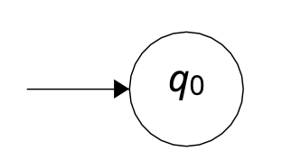

2. {ε}, language only accept empty string

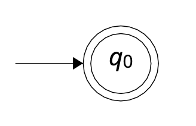

3. {a}

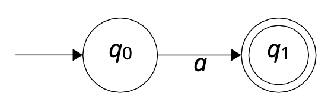

4. L<sub>1</sub> ∪ L<sub>2</sub>, assume there is ε-NFA for L<sub>1</sub> and L<sub>2</sub>

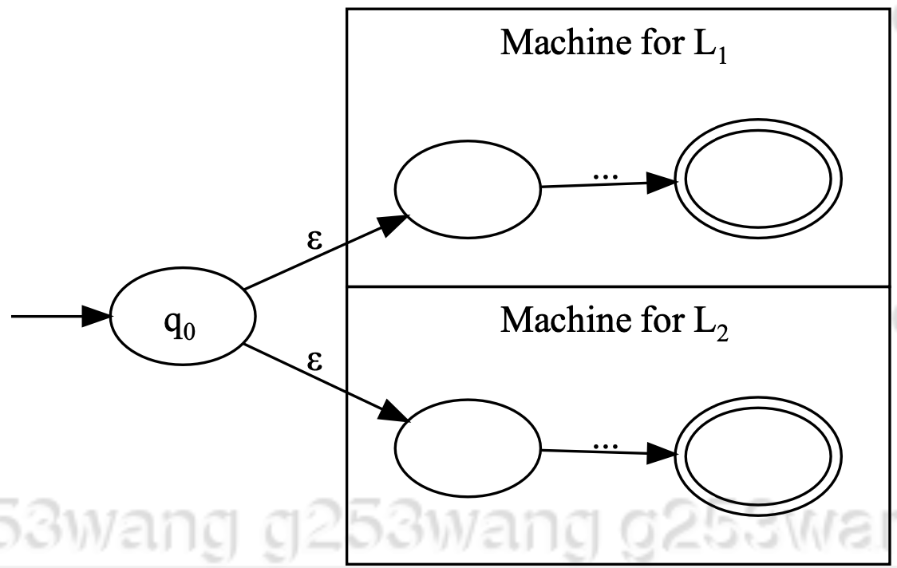

5. L<sub>1</sub>L<sub>2</sub>, assume there is ε-NFA for L<sub>1</sub> and L<sub>2</sub>

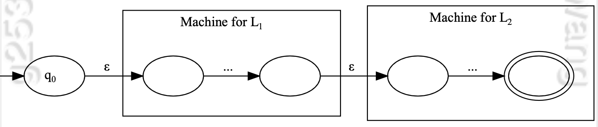

6. L<sup>∗</sup>, assume there is ε-NFA for L

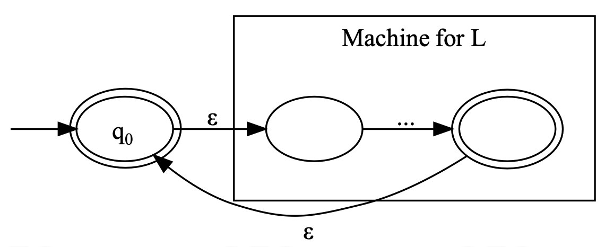

## Scanning
Is C a regular language? No.

But followings are regular:
- C keyword
- C identifier
- C literal
- C operator
- C comments

Sequences of these (union, concatenation, star) are also regular. Finite automata can do our tokenization, hence scanning. Which will break the input text into valid tokens, or reject if input is invalid.

Note: Both maximal munch and simplified maximal are greedy algorithms that seek for largest acceptable toknes, but they aren't guaranteed to find a tokenization if a tokenization exists....

### Maximal Munch
- consume characters until don't have any valid transitions
- **backtrack** to last accepting state if still have more input, output the last acceptable token, then restart with the remaining input. If there are no last seen acceptaing state, reject.

Note: at the end of a valid input, there are no valid transitions anymore, AND the last seen acceptable state is actually the last character. So we output the token, then input is now ε, and we accept the input.

### Simplified Maximal Munch
- consume characters until don't have any valid transitions
- if in accepting sate, output the token, then restart with the remaining input. Otherwise, reject.

To compansate no backtracking or recording of last seen acceptable state. We can add spaces to separate input. "ababca" -> "a b abca"

#### Algorithm for Simplefied Maximal Munch
Assuming finite automata is DFA(Σ, Q, q0, A, δ), can be replaced to use NFA or ε-NFA instead

```
w = input string
s=q0
repeat
    if δ(s, peek(w)) == ERROR then
        if s ∈ A then
            Output token for state s
            s = q0
        else
            Reject
        end if
    else
        s = δ(s, consume(w))
    end if
until w is empty

if s ∈ A then
    Output token for state s and Accept
else
    Reject
end if
```

# Lecture 9
## Context Free Grammar
CFG is essentially a set of rewrite rules

A Context Free Grammar (CFG) is a 4 tuple (N, Σ, P, S) where
- N is a finite non-empty set of ***non-terminal symbols***
- Σ is an alphabet; a set of non-empty ***terminal symbols***
- P is a finite set of productions, each of the form ***A → β***
    - where A ∈ N and β ∈ (N ∪ Σ)<sup>∗</sup>, also called V<sup>*</sup>
    - only non-terminals can appear on left side of →, hence only non-terminals can be rewritten
- S ∈ N is a starting symbol

Note: We set V = N ∪ Σ to denote the vocabulary, that is, the set of all symbols in our language.

Over a CFG (N, Σ, P, S), we say that
- A derives γ and we write A ⇒ γ if and only if there is a rule A → γ in P
- αAβ ⇒ αγβ if and only if there is a rule A → γ in P
- α ⇒<sup>∗</sup> γ if and only if a derivation exists, that is, there exists δ<sub>i</sub> ∈ V<sup>∗</sup> for 0 ≤ i ≤ k such that α = δ<sub>0</sub> ⇒ δ<sub>1</sub> ⇒ ... ⇒ δ<sub>k</sub> = γ
    - Note that k can be 0, meaning α = δ<sub>0</sub> ⇒ δ<sub>0</sub> = α, if such derivation exists

In most programming languages, the terminals (alphabet) of the context-free language are the **tokens**, which are the **words** in the regular language

Could also define CFG directly over the input characters. This does not involve any scanning phase, thus is called *scannerless*

### Example
For Σ = {(, )} and L = {w : w is a balanced string of parentheses}, S is starting symbol by convention
- S -> ε
- S -> (S)
- S -> SS

This is equivalent to
- S -> ε | (S) | SS

Find a derivation of (()())\
S => (S) => (SS) => ((S)S) => (()S) => (()(S)) => (()()) \
Hence, S =><sup>*</sup> (()())

## Context Free Language
It's like regular language + recurssion. It's expressions are defined using *grammars* (CFG)

Definition: Define the *language of a CFG (N, Σ, P, S)* to be *L(G) = {w ∈ Σ<sup>∗</sup>: S ⇒<sup>∗</sup> w}*

Definition: A language is *context-free* if and only if there exists a CFG *G* such that *L = L(G)*

### Regex -> Context Free
Every regular language is context-free. How?

Informal proof:
1. ∅: ({S}, {a}, ∅, S)
2. {ε}:({S},{a},S→ε,S)
3. {a}:({S},{a},S→a,S)
4. Union: {a} ∪ {b}: ({S}, {a, b}, S → a | b, S)
5. Concatenation: {ab}: ({S}, {a, b}, S → ab, S)
6. Kleene Star: {a}<sup>∗</sup>: ({S}, {a}, S → Sa | ε, S)

# Lecture 10
In unambiguous grammar, all expansions should get to same parse tree, regardless the order of expansion (left expand, right expand, etc.)
